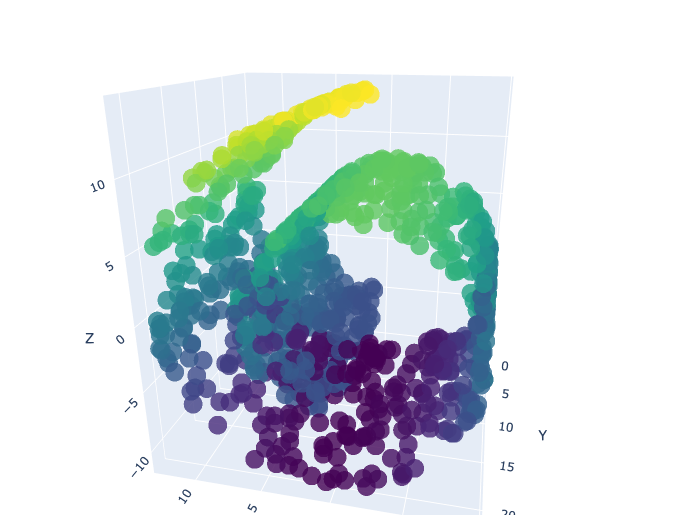

# Clustering and Manifold Learning — UC Davis STA 142B Final Project

<!-- BADGES_BEGIN -->
<p align="center">
  
  
  
  
  
</p>

<p align="center">
  
  
  
  
  
  
  
  
</p>
<!-- BADGES_END -->

Final project in two parts: an individual component covering clustering and manifold learning, and a group component applying the Gap Statistic to select the optimal number of clusters on MNIST data.

**Course:** STA 142B — Statistical Learning (Spring 2023, UC Davis)  
**Author:** Chiyang Chen

---

<p align="center">
  
</p>

---

## Part I — Individual: Clustering and Manifold Learning (`part1-individual/`)

| Section | Topic |
|---|---|
| Part 1 | Compare DBSCAN, K-Means, and Mean Shift on shaped datasets |
| Part 2 | Data visualization with t-SNE / UMAP |
| Part 3 | Multi-dimensional Scaling (MDS) and PCA |
| Extra | Image segmentation using clustering |

**Files:**
| File | Description |
|---|---|
| `notebook.ipynb` | Full analysis notebook |
| `report.pdf` | Submitted PDF report |
| `data/` | Input datasets (CSV files + feature data) |
| `plots/` | Exported Plotly figures (newplot*.png) |

---

## Part II — Group: Gap Statistic on MNIST (`part2-group/`)

| Section | Topic |
|---|---|
| Main | Implement Gap Statistic to estimate number of clusters |
| Data | MNIST handwritten digit images |
| Analysis | Apply K-Means with Gap Statistic; compare with ground truth |

**Files:**
| File | Description |
|---|---|
| `notebook.ipynb` | Full analysis notebook |
| `notebook_rendered.html` | Rendered HTML with all outputs |
| `instructions.pdf` | Original project instructions |
| `summary.pdf` | Written summary report on Gap Statistic |

---

## Key Concepts

- **DBSCAN** — density-based clustering, handles arbitrary shapes and noise
- **Mean Shift** — kernel-density-based clustering, no need to specify k
- **MDS** — preserve pairwise distances in low-dimensional space
- **Gap Statistic** — compares within-cluster variation to a reference null distribution to select optimal k

---

## Libraries

```
numpy · pandas · matplotlib · seaborn · sklearn · plotly
```

---

## How to Run

```bash
# Part I
jupyter notebook part1-individual/notebook.ipynb

# Part II
jupyter notebook part2-group/notebook.ipynb
```
